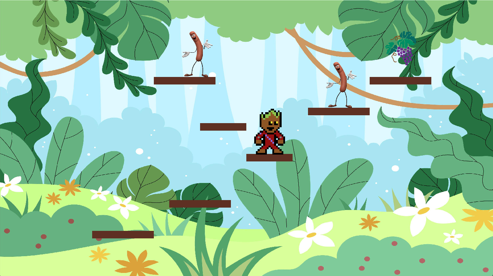

# JungleMan

Simple platformer game with smooth physics and easy level generation

## Quickstart

To run the game, run main.py.

It will automatically adjusts to your screesize so you have nothing to do.

### Elements

The crux of the game is in game.py. That is where the gameloop is. It uses instances of objects defined in separate
files to improve clarity. Make sure to have all the requirements that are in requirements.txt by
using `pip install module`
Movement and controls are handled in the class / file Jungle_man.

if you have anything to say, add me on discord : **Times#5766**

